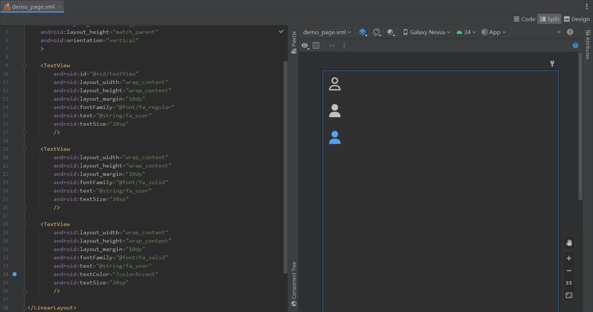

build.gradle
```groovy
repositories {
    maven { url 'https://jitpack.io' }
}

dependencies {
    implementation 'com.github.wuzhengu:fontawesome-android:6.5.2'
}
```

[DemoPage.java](./app/src/main/java/app/ui/DemoPage.java)
```java
    Typeface font = ResourcesCompat.getFont(context, R.font.fa_regular);
    CharSequence text = getText(R.string.fa_user);

    textView.setTypeface(font);
    textView.setText(text);
```

[demo_page.xml](./app/src/main/res/layout/demo_page.xml)
```xml
    <TextView
        android:layout_width="wrap_content"
        android:layout_height="wrap_content"
        android:fontFamily="@font/fa_solid"
        android:text="@string/fa_user"
        />
```


